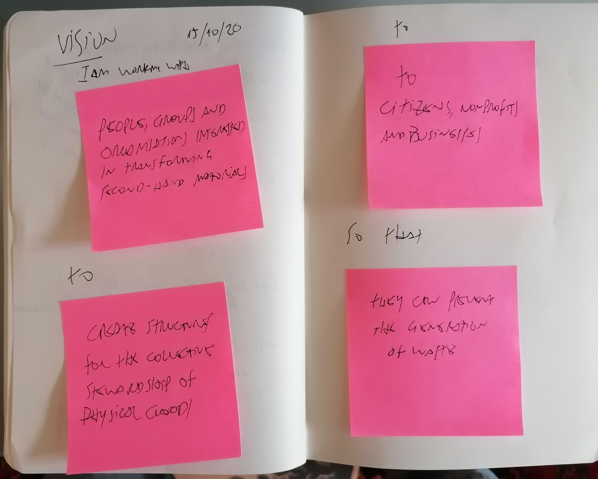
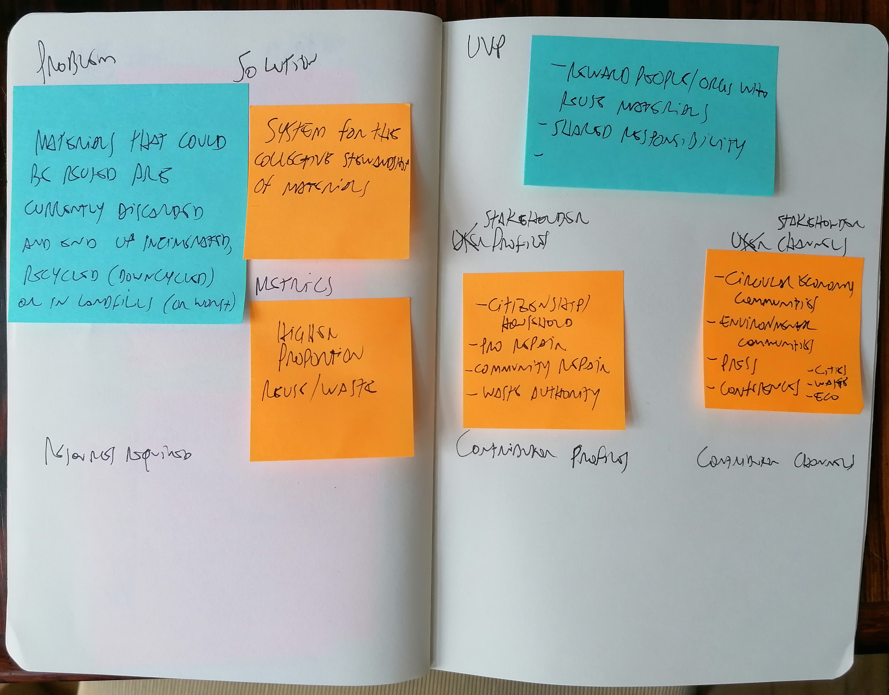

### Log - 15/10/2020

Creating this repo to document parts of my work that do not belong in the [research blog](https://is.efeefe.me/opendott). I had already created a [GitHub organisation](https://github.com/opendott-smartcities/) for my research topic last year. This repo sits there for the time being.

As often is the case, the repository was created before I had any clarity on which license to pick. I used Mozilla Public License to avoid overthinking it.

Today is the fourth day of our Internet Health training. I'm not sure whether we have any particular new tasks, but I decided to dive deeper in my impressions of the [open leadership programme](https://mozilla.github.io/open-leadership-training-series/).

This morning I forked and cloned the repo of the website hosting the contents of the course, installed the requirements and ran it locally. I learnt a bit of the structure of the course and fixed some typos and other small issues I had found there. Since the last couple of months I've been using [atom](https://atom.io/) to edit text. Its GitHub integration is great. I then pushed back the edited contents to my fork and will eventually do a PR to the original repository.

While I read again the course contents, I went back to the docs I started filling these last days. First, the vision for my project:

I must add that I'm not at all comfortable with these predefined formats and intend to write more extensively on why that is, but will play the game nonetheless.

Then to the open canvas. While I do like the canvas format as it allows one to start from any point and go about building the rest, I always find it insufficient to understand scenarios in depth. Some years ago I attended an online course on systems thinking (offered by [Acumen Academy](https://www.acumenacademy.org/courseCatalog/)) that helped me understand this sort of approach in which every part arguably influences all the others, but still... not that easy. But as I said, I'll write more about it.

Today I managed to work on the top part of the canvas - thus excluding anything related to its execution (and skipping the name for the time being). It was a little hard to decide on a single "product", so I went for an overall approach that will eventually trickle down to specific parts or sub-projects. I decided also to rename "user profiles" and "user channels" for "stakeholder profiles" and channels, respectively.

A note on file naming conventions: a friend taught me to use inverted dates - YYYYMMDD -, so when you list or see them in a file browser you can have a sense of when the files were created (in some occasions, listing by date will use the last modified date, which is not useful for this kind of log).

Yesterday's slides: it's about **power**. Yes! That's the core of the thing. No real openness unless we discuss power relations (and privilege, and unintentional silencing).

---

PS I've updated the [repository's README](https://github.com/opendott-smartcities/waste-prevention) as well.
